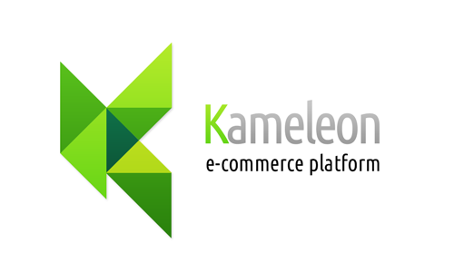
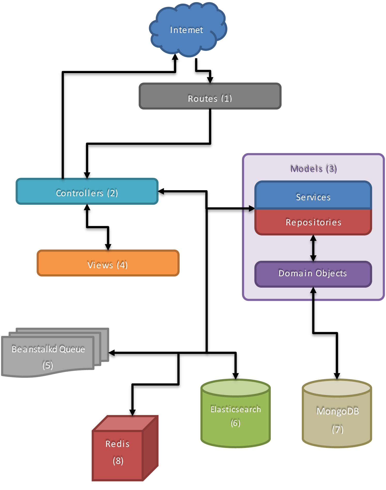
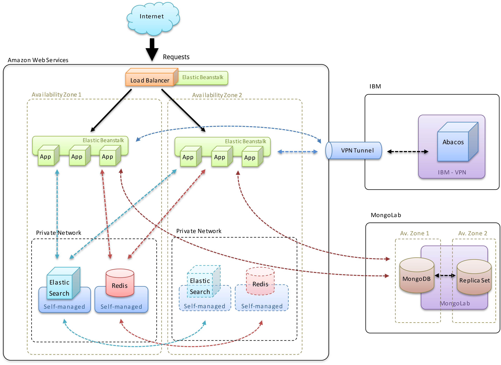

# Kameleon _Architecture and Technology_

## Summary

Developed with an agile small team at Leroy Merlin Brazil applying a set of new innovate web technologies, **Kameleon is a e-commerce platform that is currently being used in production**, hosted using scalable PAAS
cloud and displaying more than 60.000 products and over 1000 categories of complex DIY products.
The platform is distributed and highly scalable, designed to automate advanced e-merchandising and merchandising concepts to help customer navigate easily to find the right product, in good quantity with a good price.

Kameleon has the objective to be flexible to different business models and to support an Omni channel.
In environments where product technical complexity is high, you need to mantain lowering costs,
improve customer's experience, handle rich data about the products and dynamic content, was in this environment Kameleon was built.
Kameleon uses a powerfull non-tabular engine to handle _Advanced Relations_ between every resource (products, categories, dynamic content and others).
By using this approach, the admininstrators input business rules into the platform instead of focusing in manual operations for each new resource added.

<blockquote class="emphasys">
    _Kameleon_  offers one culture change in pro to reach the omni channel in retail market, spreading
    in certain intelligent way the technical knowledgement, implanting all brand's mershadising principles,
    aiming our dream to deliver the best product, in a good quantity with a fair price for our customers
    as smoothly in all channels.
</blockquote>

<blockquote class="emphasys">This document will give you a technical overview of the <em>Kameleon Platform</em>. We first discuss the key software layers and architecture. Next, we show you how easly it is to get started with the software usage. We cover our built-in as well as how to do custom integrations with external systems.</blockquote>

## Overview

<small>This section will give you a broad overview of the Kameleon architecture. Later we will dive into individual topics, but before we do this we would like you to understand the lean and lightweight approach we have taken for the design of the Kameleon.</small>

### Technologied Involved

Kameleon is built on top of the [Laravel Framework](http://laravel.com) using modern PHP code, [MongoDB](http://www.mongodb.org/) as it's primary storage and [Elasticsearch](http://www.elasticsearch.org/) as the Search engine behind the _Advanced Relation_ technology. The plataform is distributed, high performant and all the main components are horizontally scallable.

#### Application Server

_Kameleon Application Server_ has been constructed using Laravel, a web framework made to build huge enterprise applications. It is built on top of several [Symfony](http://symfony.com/) components, giving the platform a great foundation of well-tested and reliable code. Laravel core uses the [inversion of control architecture](http://en.wikipedia.org/wiki/Inversion_of_control) to increase modularity of the program and make it extensible

>  _"This inversion of control gives frameworks the power to serve as extensible skeletons. The methods supplied by the user tailor the generic algorithms defined in the framework for a particular application._
**_- Ralph E. Johnson & Brian Foote_ - ["Designing Reusable Classes" Journal of Object-Oriented Programming](http://www.laputan.org/drc/drc.html)**

#### Database

**MongoDB** is an open-source non-relational document database, and the leading NoSQL database. Written in C++, MongoDB features replication and high availability and scales horizontally without compromising functionality. The storage is based in [JSON-style documents](http://json.org/) with dynamic schemas offer simplicity and power.

The dynamic schema capability of MongoDB is a powerfull feature for handling dynamic attributes of the resources handled by the plataform, for example, a hundred different product types with different attributes. The relational/SQL database solution for dynamic attributes is know as EAV (Entity Attribute Value) which is proven to lead to performance degradation, problems in data type integrity, referential integrity.

> _"What the  SQL Server programming newsgroup post described is called EAV (“Entity-Attribute-Value”) tables and it is a very common schema design error for programmers who started with an OO or a loosely typed programming language."_
**_- Joe Celko_ - [Avoiding the EAV of Destruction](https://www.simple-talk.com/sql/t-sql-programming/avoiding-the-eav-of-destruction/)**

The NoSQL capabilities and performance provided by MongoDB creates a persistency layer that is also scalable horizontally.

#### Searchengine

_Kameleon's Advanced Relation Technology_ is built using the **Elasticsearch**, a flexible and powerful open source, distributed, real-time search and analytics engine. Architected from the ground up for use in distributed environments where reliability and scalability are must haves, Elasticsearch gives Kameleon the ability to move easily beyond reference relations between resources and simple full-text searchs.

Through the usage of the Searchengine the plataform can handle facets, analytics and it's _Advanced Relations_. These special kind of relations are based in business rules that can be built using an graphic interface and that will always bring up to date resource that matched by the rules with facet and text-search support.

#### Caching

The _Kameleon Cache Middleware_ is part of the Kameleon server and it reduces the amount of database and searchengine queries. Besides the overall lean and efficient architecture, it is another reason why Kameleon has greater performance per single server node than other solutions. The persistence cache transparently caches requests responses and query results into memory and automatically clear these caches if a change in the involved resources happened.

For a cached request, many of the application components doens't even need to be instanciated. The request can be responded before even reaching the controllers. Due to this, it is not needed to use an reverse proxy for most deployments.

The storage technology used behind _Kameleon Cache Middleware_ is [Redis](http://redis.io/), an open source, BSD licensed, advanced key-value cache and store database.

> "With more than 5000 pageviews per minute in our production environment we didn't have to use any kind of reverse proxy. _Kameleon Cache Middleware_ handles all the requests, faceted searchs and _advanced relations_ for more than 5 million unique visitors per month with only three server nodes."
**_- Zizaco Zizuini_ - Leroy Merlin Brazil Web Developer**

#### Asynchronous Jobs

Kameleon uses **[Beanstalkd](http://kr.github.io/beanstalkd/)** work queue with a generic interface that was originally designed for reducing the latency of page views in high-volume web applications by running time-consuming tasks asynchronously.

By using Laravel queue capabilities with Beanstalkd, Kameleon can handle background jobs as exporting reports, batch creation or update of resources, caching, and searchengine communication asynchronously. This improves the response times of the requests that need to be handled in real time while queues background jobs that don't need the same priority as then.

Kameleon also uses [Indatus Dispatcher](https://github.com/Indatus/dispatcher), a command scheduling tool used to schedule jobs per environment. This way you can extend the platform to run custom tasks in the background and in a distributed way.

## Development

### Install and Run

_Kameleon Application Server_ is easy to install and run. The whole package is less than 1.0GB. Once unzipped into a local directory, the only requirement to run our software is an up-to-date PHP installation _(greater or equal 5.4)_ able to run Laravel and Composer. Kameleon also ships with a `Vagrantfile` and a server recipe that allows the setup of the development environment to be done using [Vagrant](http://vagrantup.com/).  Later, in production, the same code that runs on developer machines will also run on the server machines.

<blockquote class="emphasys"><em>Vagrant</em> provides easy to configure, reproducible, and portable work environments built on top of industry-standard virtualization technology and controlled by a single consistent workflow to help maximize the productivity and flexibility.</blockquote>

A typical startup of the preconfigured Kameleon on a Virtual Machine using Vagrant takes less than 20 minutes.

### Developer Profile

We do not believe that special tools and IDEs should be required to customize our software. Therefore, any PHP IDE or editor can be used for development. We recommend _Sublime Text 3_, but developers are free to choose the tool of preference.

In order to fully understand and customize the plataform code the following profile is recomended:

1. Experienced Object Oriented developer that knows modern PHP
2. Understanding of MongoDB/NoSQL concepts
3. Experience writing automated tests using PHPUnit or similar
4. Knowledge on how the HTTP Protocol works

### Configuration

In Kameleon, most of the configuration is done through environment variables in the machine where the _Kameleon Application Server_ is running. This approach is more server oriented in order to be more cloud friendly. Most of the cloud solutions allow the use of a single virtual machine image to multiple machines but to customize the environment variables of each one of then. This allows the same server image to be used in all environments (production, staging, etc) where only the environment variables would point to different databases.

Also it is possible to change de configuration files of _Kameleon Application Server_ by hand. They follow the [Laravel config files convention](http://laravel.com/docs/5.0/configuration) and it is possible to repleace the environment variable input with specific values. This approach is fully supported altought it is not recomended, nor considered very maintainable when you have multiple server instances.

For development environment (using [Vagrant](#install-and-run)) there is no need to tweak any configuration.

### Customization

All parts of _Kameleon Application Server_ can be customized, if you wish to. Each inner interface that is referenced through the [IoC Container](http://laravel.com/docs/5.0/container) can be completely replaced. Also, Kameleon can be extended with any _library /package_ that follows the [Composer Convention](https://getcomposer.org/doc/02-libraries.md). Due to that, all the open-source packages listed in the [Packalyst](http://packalyst.com/) and [Packagist.org](https://packagist.org/) can be used to add new capatibilities to the plataform.

<blockquote class="emphasys"><em>Kameleon Platform</em> can be extended with any of the <strong>more than 50 thousand</strong> packages available in Packagist.org</blockquote>

The [Laravel service container](http://laravel.com/docs/5.0/container) is a powerful tool for managing class dependencies. [Dependency injection](http://en.wikipedia.org/wiki/Dependency_injection) is a fancy word that essentially means that class dependencies are _"injected"_ into the class via the constructor or, in some cases, _"setter"_ methods.

There are several ways the service container can register dependencies. The registration of these dependencies allows the developers to easly replace any component of the application. Of course a deep understanding of the Laravel service container is essential to building powerful custom features, as well as for contributing to the _Kameleon Application Server_.

_Kameleon_ is also strong in internationalization by using the [localization feature of Laravel](http://laravel.com/docs/5.0/localization). By default it supports portuguese, but you may create your own translation easly.

### Software Architecture

<small>The _Kameleon Application Server_ is build using the [best practices of PHP programming](http://www.phptherightway.com/). Which includes _OO_, _Dependency Injection_, _Coding Standards_, [Composer](https://getcomposer.org) for dependency management, _Test Driven Development_ and _Continuous Integration_. In this section we will present a simplified view on how the main building blocks of the application works.</small>

#### 1. Routes

The main route file `app/routes.php` includes specific purpose route files that lives within `app/routes/` directory. Some relevant points are:

- Admin routes will only be registered if necessary, which means, only if the `ADMIN` constant is present in the `Input::path()`
- Admin routes will use the `ADMIN` constant in their path, so if (for security reasons) you want to change the admin path, simply change the volue of the constant.

#### 2. Controllers

There are two groups of controllers. The ones that don't have namespaces and the ones that live within the `Admin` namespace. They contain minimal or no logic and simply call **Services** that will get the job done or that will retrieve data. Finally they may render a view and return a response.

The tests for the controllers (that also test the routes) lives within `app/tests/controllers` directory.

#### 3. Models

> Model Layer is where the business logic resides.

The components domain objects and services are organized in namespaces (and directories) that describe to which subject they relate to.

In order to understand the **Model Layer** of Kameleon is important to make the following terminology clear:

##### Domain Objects

A domain object is where lies the domain logic, usually represents an entity in the domain. This is the place where definitions like data validation, behaviors and formulas live.

##### Data Mapper

A data mapper sends the object data to a database, keeping them independent of each other but sync'ed. This is not exactly a class, but the fact that a domain object extends from a mapper, for example: `... extends MongoLid`

##### Services / Repositories

Services are basically components that are triggered to help the business rules to be achieved. An service can be:

- An implementation of an email delivery that is triggered by a domain object in a given moment.
- A class that process a spreadsheet or a csv file.
- A class that crops the user picture.
- A class that abstracts some database interaction.

Some services (called _"Repositories"_) abstracts the interaction between domain objects and the data mapper methods. They exist in order to simplify the code within the controllers. For example: the creation of a new user account can require alot of inner logic and domain object manipulation using the data mapper functions, but using a Repository Service the controller may simply call one or two methods of the repository.

##### References

- [Organizing Snappy - Taylor Otwell](http://blog.userscape.com/post/organizing-snappy)
- [How should a model be structured in MVC - tereško (Stackoverflow)](http://stackoverflow.com/a/5864000)
- [ACL implementation (Side Notes) - tereško (Stackoverflow)](http://stackoverflow.com/a/9685039)
- [ModelViewController - Martin Fowler](http://martinfowler.com/eaaCatalog/modelViewController.html)
- [DomainModel - Martin Fowler](http://martinfowler.com/eaaCatalog/domainModel.html)
- [Repository - Martin Fowler](http://martinfowler.com/eaaCatalog/repository.html)
- [DataMapper - Martin Fowler](http://martinfowler.com/eaaCatalog/dataMapper.html)

#### 4. Views

##### Organization

The `app/views` directory contains two main directories. The `admin`, which
contains views that are specific to the administration panel, and the
`front_end`, which contains the views that are going to be shown to the visitors
of the website. The `front_end` directory contains the `base` template, and
may contain additional directories for other template.

#### 5 Beanstalkd Queue

Beanstalk is a simple, fast work queue. Its interface is generic, but was originally designed for reducing the latency of page views in high-volume web applications by running time-consuming tasks asynchronously. **Services** may queue jobs that will be processed asynchronously, the queued jobs will call these same **Services** again.

The jobs lives in the `app/jobs` directory.

##### Queues

There are two queues in the application. The `light` and the `heavy` queue. The `light` is used for search engine indexation and cache cleaning while the `heavy` run more complex operations, I.E: Spreadsheet processing, importing, image processing, etc.

In order to run workers for both queues you must call

    php artisan queue:listen heavy
    php artisan queue:listen light

#### 6 Elasticsearch

Elasticsearch uses Lucene under the covers to provide the most powerful full text search capabilities available in any open source product. The **Repositories** will index and retrieve **Domain Objects** in Elasticsearch.

#### 7 MongoDB

The **Domain Objects** persists in a MongoDB database. Some domain objects has it's own collection, but many of then are actually documents that are embedded into other documents.

### Software Domain

The models in the are built as described in the previous section [Models](#3-models). The business rules and the logic contained here describe many different cases and behaviors. It's this complexity that the classes within the _Model Layer_ were designed to work with. The Domain Model creates a web of interconnected objects, where each object represents some meaningful individual.

#### Namespaces

When looking at the code in the _Model Layer_, it's important to note that all _domain objects_, _services_ and _repositories_ are placed inside contextual namespaces that will usually explain to which business rule it relates to. Also, each namespace contains a `README.md` file that will describe how it works in isolation.

All the dependencies between the namespaces are done through dependency injection using  [Laravel's IoC Container](http://laravel.com/docs/5.0/container), so it's possible to replace a whole namespace with a custom code once all the interfaces are implemented accordingly.

**List of _Namespaces_:**

Namespace             | Description
--------------------- | -------------
`AdvancedRelation`  | Takes care of the relationship between resources (products, categories, materials, videos, etc.). Contains code that abstracts the queries between those relations.
`Assistant`         | Backed by the `Assistant` entity, `Variable` and `Output` value objects, this _namespace_ aims to represents a _"wizard"_ that will help the customer to find the right product to the right quantity.
`Carousel`          | Handle simple content aggregation such as galeries and carousels.
`Cart`              | Implements the shopping cart for eCommerce.
`Checkout`          | Assembles and retrieve the objects that are used in the checkout process.
`Content`           | Contains all the CMS related code.
`Course`            | Handles course scheduling and signup.
`Dashboard`         | Group all information that is relevant to the admin panel dashboard.
`Email`             | Email related business rules.
`Multitree`         | The implementation of the [Multitree concept](http://en.wikipedia.org/wiki/Multitree)
`Picture`           | Handles picture domain objects. Also takes care of image croping and resizing.
`Product`           | Contains the implementation for the general business rules related to products
`ProductBank`       | Mainly contains the _domain object_ that represents each group of products that share the same characteristics.
`Redirection`       | Allows the creation of page redirections. Mainly for SEO purposes.
`SaleOrder`         | The code related to customer order placement as `SaleOrder` _domain objects_.
`Shipping`          | Shipping information for a orders. It gathers cost and delivery dates.
`SiteMapper`        | Generates sitemaps for SEO purposes.
`User`              | Customer related code
`UserTracker`       | Backed by the `UserTrack` entities. This _namespace_ aims to store the behavior and interactions of each user in a level of detail where it is possible to tell which products and matters of interest are that visitor.

## Deployment Architecture

<small>The main components of a Kameleon deployment are distributed and horizontally scalable, being possible to handle a growing volume of request simply by adding more nodes to the deployment.</small>

An Kameleon deployment is composed by four kind of servers:

- Application server
- Database servers
- Searchengine servers
- Redis servers

<blockquote class="emphasys">It's important to know the role of each of this components in order to correctly scale the environment. Also software performance monitoring is recomended in order to find the kind of node that should be added to your deployment in order to handle a higher volume of requests.</blockquote>

